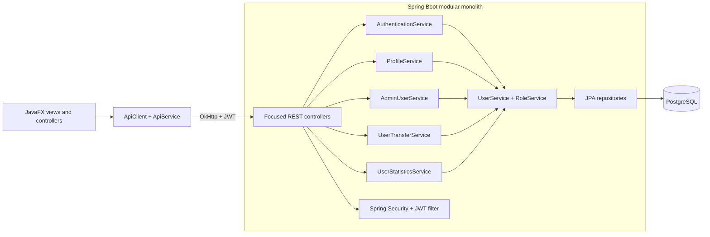

# Architecture Direction

## Product boundary

Team Access Hub remains a modular monolith with a desktop administration
client. This boundary is large enough to demonstrate backend, security, data,
operations, and desktop engineering without introducing distributed-system
complexity the product does not need.

The API is the system of record. JavaFX is one client of that API and must not
contain an authorization rule that the server does not independently enforce.

## v0.2 current shape

The secure baseline corrected responsibility concentration without changing the
deployment model or public API:

- Authentication, profile, administration, statistics, and transfer routes are
  separate controllers.
- Transactional application services own orchestration and invariants.
- Response DTOs keep JPA entities internal.
- A transport boundary separates JavaFX HTTP concerns from in-memory session
  state.
- Flyway owns schema evolution and Hibernate validates the result.
- Import, generated download, and CSV export data stay in memory rather than
  writing request output to repository files.

## Current backend packages

The existing package layout is a staged modular-monolith boundary, not a set of
separate deployables:

| Package area | Owns | Does not own |
| --- | --- | --- |
| `controller` | HTTP validation, authorization annotations, response mapping | Transactions and domain orchestration |
| `service` | Authentication, profile, administration, transfer, statistics, policy, transactions | HTTP presentation |
| `payload.request` | Explicit external input shapes | Persistence behavior |
| `payload.response` | Explicit public output shapes and mapping | Mutable entity state |
| `security` | JWT parsing, authentication population, route policy | Business authorization invariants |
| `repository` | PostgreSQL persistence queries and locking | HTTP or UI concerns |
| `model` | Internal JPA state | Public API serialization contracts |

The longer-term `identity`, `access`, `audit`, `admin`, and `shared` package
modules remain a roadmap direction. Creating them before their Phase 2 use
cases exist would be premature.

## Current JavaFX boundaries

- `controller`: programmatic screens, event handling, and current presentation
  coordination.
- `api.ApiClient`: OkHttp transport and Gson mapping.
- `service.ApiService`: typed operations composed with session state.
- `service.SessionManager`: in-memory token and current principal.
- `config.ClientConfiguration`: validated API base URL resolution.
- `util`: navigation and reusable presentation helpers.

Refactoring continues screen by screen rather than through a client rewrite.
Future boundaries remain:

- `view`: JavaFX nodes and styling only.
- `viewmodel`: screen state, input validation, and commands.
- `api`: typed transport models, HTTP calls, and error mapping.
- `session`: access-token lifecycle and current principal.
- `navigation`: screen transitions.

## API rules

Rules already enforced in v0.2:

- Accept explicit restricted input where privileged data is involved.
- Return response DTOs rather than JPA entities.
- Validate request bounds and repeat critical invariants in services.
- Cap pagination, import, export, and generated data sizes.
- Use allow-listed sort fields.
- Generate downloads in memory.
- Preserve the established `/api` contract during the secure baseline.

Rules deferred to a future contract milestone:

- Version the public API under `/api/v1`.
- Replace the legacy error envelope with one RFC 9457-style problem format.
- Publish and verify a versioned OpenAPI contract.
- Standardize machine timestamps on `Instant` and ISO-8601 UTC.

## Security rules

- Keep credentials and signing material outside source control.
- Never log tokens, passwords, hashes, reset codes, or full sensitive payloads.
- Keep self-registration and Swagger behind explicit environment policies.
- Prevent deletion, suspension, or demotion of the last active administrator.
- Keep tokens in JavaFX memory unless an operating-system credential store is
  introduced.
- Add refresh-token rotation and server-side revocation before offering
  persistent sessions.
- Record login, invitation, role/status, password, revocation, import, and
  export events when the audit module is introduced.

## Persistence rules

- Flyway migrations are the only runtime schema-change mechanism.
- Hibernate validates rather than mutates the schema.
- Entity setters and JSON deserialization stay away from password hashes, role,
  status, and audit metadata at public boundaries.
- PostgreSQL Testcontainers exercise production SQL behavior in tests.
- Mutable administrative records should gain optimistic locking when Phase 2
  introduces concurrent lifecycle workflows.
- Future audit events must be append-only.

## Testing strategy

| Level | Current evidence | Next focus |
| --- | --- | --- |
| Unit | Services, mapping, bounds, CSV safety, client configuration/session | Invitation expiry and permission evaluation |
| MVC/security | Public/protected policy, JWT failures, DTO and error compatibility | Versioned problem responses |
| PostgreSQL integration | Flyway, uniqueness, transactions, last-admin race, import/export | Sessions and audit persistence |
| Configuration | Secrets, profiles, Compose, CI, documentation, packaging | Static and dependency analysis |
| JavaFX headless | Transport, routing, session isolation, sensitive-output silence | View models and error states |
| End-to-end | Compose readiness and packaged-launcher smoke checks | Invite-to-audit product journey |

## Architecture decision policy

Capture consequential Phase 2 choices as short ADRs under `docs/decisions/`.
The first useful decisions are token/session strategy, invitation-only versus
configurable signup, audit retention, and JavaFX state-management boundaries.
Do not split Maven modules or services without evidence that package-level
boundaries are insufficient.
