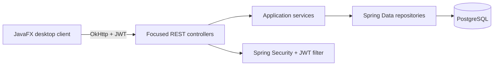

# Team Access Hub

Team Access Hub is a Spring Boot identity and access operations API with a
JavaFX desktop administration client. The current v0.2 secure baseline focuses
on protecting credentials and personal data, enforcing two-role access rules,
and making the existing application reproducible through migrations,
containers, automated tests, CI, and a native desktop image.

The product direction is an invitation-led access lifecycle with revocable
sessions and an audit trail. Those capabilities are planned work; they are not
part of v0.2.

## Secure baseline scope

The implemented baseline includes:

- JWT login and policy-controlled self-registration.
- Member profile read, update, and password change.
- Administrator user listing, search, pagination, update, deletion, role
  change, and enable/disable workflows.
- A transactional last-active-administrator safeguard.
- Bounded fake-user generation and restricted JSON import.
- Bounded, UTF-8 CSV export with spreadsheet-formula neutralization.
- Explicit response DTOs that do not expose password hashes or persistence
  identifiers for roles.
- Externalized database credentials and JWT signing material.
- Flyway-managed PostgreSQL schema validation.
- Public, redacted liveness and readiness probes.
- Testcontainers integration tests, one-command verification, and GitHub
  Actions CI.
- Docker Compose startup for PostgreSQL and the API.
- A configurable, testable JavaFX API client and a platform-native app image.

## Architecture

The repository is a modular monolith with one desktop client. The API remains
the system of record and independently enforces every authorization rule.



Backend workflows are split across authentication, profile, administration,
statistics, and transfer boundaries. The JavaFX client keeps its token and
current principal in memory and uses a separate transport boundary. See
[Architecture Direction](docs/ARCHITECTURE.md) for current and future
boundaries.

## Prerequisites

- JDK 17 or later. A JDK containing `jpackage` is required only for desktop
  packaging.
- Docker Desktop or another Docker-compatible engine.
- Windows PowerShell 5.1 or PowerShell 7.
- Network access on the first build so the Maven wrapper and dependencies can
  be resolved.

Maven and PostgreSQL do not need to be installed separately for repository
verification.

## Evaluate in under ten minutes

From a clean checkout, start Docker and run:

```powershell
.\scripts\verify.ps1
```

This runs the complete backend suite against disposable PostgreSQL
Testcontainers and then runs the headless JavaFX suite. It stops at the first
failed module and returns a non-zero exit code. It does not read or modify a
developer `.env` file or local PostgreSQL database.

If local script execution is blocked, use a process-scoped bypass:

```powershell
powershell.exe -NoProfile -ExecutionPolicy Bypass -File .\scripts\verify.ps1
```

Focused module commands are:

```powershell
.\mvnw.cmd test
.\mvnw.cmd -f javafx-client\pom.xml test
```

GitHub Actions runs the same repository verifier on every push and pull
request with JDK 17 and Docker. Dependabot checks the backend, desktop client,
and workflow dependencies weekly.

## Configuration

No usable credential or signing key is committed. Backend startup requires the
following environment variables:

| Variable | Purpose |
| --- | --- |
| `DB_URL` | PostgreSQL JDBC URL for a host-run backend |
| `DB_USERNAME` | PostgreSQL username |
| `DB_PASSWORD` | PostgreSQL password |
| `JWT_SECRET` | Base64-encoded JWT key with at least 256 bits |
| `JWT_EXPIRATION_MS` | Optional access-token lifetime; default `86400000` |
| `DEMO_REGISTRATION_ENABLED` | Optional registration policy; default `false` |
| `DEMO_SWAGGER_ENABLED` | Optional Swagger policy; default `false` |

The `dev` profile requires externally supplied `DEMO_ADMIN_USERNAME`,
`DEMO_ADMIN_PASSWORD`, and `DEMO_ADMIN_EMAIL`. It enables registration and
Swagger unless either policy is explicitly overridden. The default profile
does not initialize an account.

The tracked [.env.example](.env.example) contains names and placeholders only.
Spring Boot does not load `.env` automatically; keep real values in the shell,
IDE configuration, deployment environment, or another ignored secret store.

## Run locally with JavaFX

This is the recommended first-run path for checking the complete desktop
experience, including administrator screens. It starts PostgreSQL with Compose,
runs the API in the opt-in `dev` profile, creates an administrator using values
you choose, and launches JavaFX from Maven.

### 1. Create local backend configuration

From the repository root:

```powershell
Copy-Item .env.example .env
```

Generate a local JWT signing key:

```powershell
$bytes = New-Object byte[] 32
$rng = [Security.Cryptography.RandomNumberGenerator]::Create()
$rng.GetBytes($bytes)
$rng.Dispose()
[Convert]::ToBase64String($bytes)
```

Edit the ignored `.env` file. Supply your own `DB_USERNAME`, `DB_PASSWORD`,
and paste the generated value into `JWT_SECRET`. Do not commit `.env`.

### 2. Start PostgreSQL

```powershell
docker compose build api
docker compose up -d postgres
docker compose ps
```

Wait until `team-access-hub-postgres-1` reports `healthy`.

### 3. Choose a development administrator and start the API

In the same PowerShell window, enter values that you will use to log in:

```powershell
$devAdminUsername = Read-Host "Choose a development administrator username"
$devAdminPassword = Read-Host "Choose a development administrator password"
$devAdminEmail = Read-Host "Choose a development administrator email"

if ([string]::IsNullOrWhiteSpace($devAdminPassword) -or $devAdminPassword.Length -lt 8) {
    throw "Use a non-empty password containing at least 8 characters."
}
```

Start the API in the foreground:

```powershell
docker compose run --rm --service-ports -e "SPRING_PROFILES_ACTIVE=dev" -e "DEMO_ADMIN_USERNAME=$devAdminUsername" -e "DEMO_ADMIN_PASSWORD=$devAdminPassword" -e "DEMO_ADMIN_EMAIL=$devAdminEmail" api
```

Leave this window open. Successful first-time startup includes
`Development administrator initialized` and `Started DemoApplication`.

The initializer creates a missing username but deliberately does not reset an
existing account's password. Reuse the original password with a retained
database volume. If the data is disposable and you need a completely fresh
local setup, stop the API and run `docker compose down --volumes` before
repeating these steps. This permanently deletes the local Compose database.

### 4. Verify readiness and launch JavaFX

Open a second PowerShell window in the repository root:

```powershell
Invoke-RestMethod http://localhost:9090/actuator/health/readiness
Set-Location javafx-client
..\mvnw.cmd javafx:run
```

Readiness should report `UP`. Log in with the administrator username and
password chosen in step 3.

### 5. Stop the local stack

Close JavaFX, press `Ctrl+C` in the API window, return to the repository root,
and run:

```powershell
docker compose down
```

This retains the named PostgreSQL volume for the next run.

## Container startup

Create an ignored Compose environment file and replace every angle-bracket
placeholder before starting services:

```powershell
Copy-Item .env.example .env
# Edit .env and supply DB_USERNAME, DB_PASSWORD, and JWT_SECRET.
docker compose config
docker compose up --build -d
docker compose ps
Invoke-RestMethod http://localhost:9090/actuator/health/readiness
```

Compose derives its container-only JDBC URL from `DB_NAME` and the `postgres`
service. Registration and Swagger remain disabled unless their environment
policies are enabled. This baseline Compose stack does not seed a login
account; use externally managed data or the host-run `dev` workflow when an
interactive administrator account is needed.

Stop services while retaining PostgreSQL data:

```powershell
docker compose down
```

`docker compose down --volumes` intentionally deletes the named database
volume and all of its local data.

## Host development startup

Start PostgreSQL, supply the required backend variables in the shell or IDE,
and then run:

```powershell
.\mvnw.cmd spring-boot:run
```

For opt-in development initialization, activate `dev` and supply all three
`DEMO_ADMIN_*` variables before startup. There is no documented or committed
default login.

Flyway creates version 1 of the schema for an empty database and Hibernate
validates it. Before adopting a pre-Flyway database, back it up, compare it to
`src/main/resources/db/migration/V1__baseline.sql`, and follow the guarded
baseline procedure in [Project Context](docs/PROJECT_CONTEXT.md).

## JavaFX startup and packaging

The client uses `http://localhost:9090/api` for local development unless the
complete API URL is overridden:

```powershell
$env:TEAM_ACCESS_HUB_API_BASE_URL = "https://access.example.com/api"
Set-Location javafx-client
..\mvnw.cmd javafx:run
```

The JVM property `teamaccesshub.api.base-url` is also supported and takes
precedence over the environment variable. The value must be an absolute HTTP
or HTTPS URL without credentials, query, or fragment.

Build and test a native application image from the repository root with:

```powershell
powershell.exe -NoProfile -ExecutionPolicy Bypass -File .\javafx-client\package.ps1
```

See the [JavaFX client guide](javafx-client/README.md) for platform-specific
artifact and launcher paths.

## API contract

All domain endpoints use the existing unversioned `/api` contract.
Authentication requires a bearer token except where noted.

| Method | Path | Policy |
| --- | --- | --- |
| `POST` | `/api/auth` | Public login |
| `POST` | `/api/auth/register` | Public only when registration policy is enabled; denied by default |
| `GET` | `/api/users/me` | Authenticated member |
| `PUT` | `/api/users/me` | Authenticated member |
| `PUT` | `/api/users/me/password` | Authenticated member |
| `GET` | `/api/users/{username}` | Administrator |
| `GET` | `/api/users` | Administrator; bounded pagination and allow-listed sorting |
| `GET` | `/api/users/id/{id}` | Administrator |
| `PUT` | `/api/users/{id}` | Administrator |
| `DELETE` | `/api/users/{id}` | Administrator |
| `PATCH` | `/api/users/{id}/role` | Administrator |
| `PATCH` | `/api/users/{id}/status` | Administrator |
| `GET` | `/api/users/generate/{count}` | Administrator; `count` 1-1000 |
| `POST` | `/api/users/batch` | Administrator; JSON file up to 1 MiB and 1000 records |
| `GET` | `/api/users/export/csv` | Administrator; at most 10000 rows |
| `GET` | `/api/stats/users` | Administrator |

The public operational probes are:

- `GET /actuator/health/liveness`
- `GET /actuator/health/readiness`

Aggregate health is authenticated. Swagger routes are denied by default and
are available only when `DEMO_SWAGGER_ENABLED=true` or the `dev` policy enables
them.

## Security and data boundaries

- Access tokens, passwords, hashes, signing material, and full sensitive
  payloads must not be logged or committed.
- JWT access tokens are stateless. Disabled users are rejected when their
  identity is loaded, but v0.2 has no refresh-token inventory or explicit
  per-session revocation.
- Generated JSON contains no credential field. Imported accounts are disabled
  and receive server-owned encoded credentials.
- User API responses are explicit DTOs and never expose the password field.
- CSV output is UTF-8, bounded, structurally escaped, and neutralized for common
  spreadsheet formula prefixes.

## Known limitations

- Invitations, explicit lifecycle states, refresh-token rotation, session
  management, and audit history are Phase 2 work.
- The API remains under `/api` rather than a versioned public contract.
- Authorization currently uses only `ROLE_USER` and `ROLE_ADMIN`.
- Access tokens default to a 24-hour lifetime and cannot be individually
  revoked.
- The JavaFX UI is programmatic and its controllers still contain substantial
  presentation logic.
- Desktop images are unsigned and platform-specific; the packaging workflow
  does not cross-compile.
- The Compose baseline proves deployment and readiness but does not seed an
  interactive account.
- There is no hosted demo, tagged release, screenshot set, or explicit license
  file yet.

## Documentation

- [Project Context](docs/PROJECT_CONTEXT.md): verified current state, commands,
  and risks.
- [Architecture Direction](docs/ARCHITECTURE.md): current boundaries and planned
  evolution.
- [Portfolio Roadmap](docs/PORTFOLIO_ROADMAP.md): product direction and deferred
  phases.
- [Implementation Plan](docs/IMPLEMENTATION_PLAN.md): v0.2 task definitions and
  validation gates.
- [Changelog](docs/CHANGELOG.md): task-level implementation and verification
  history.

## Repository layout

```text
.
|-- src/main/java/                  Spring Boot API
|-- src/main/resources/db/migration Flyway migrations
|-- src/test/java/                  Backend and integration tests
|-- javafx-client/                  JavaFX client, tests, and packaging
|-- scripts/verify.ps1              Ordered repository verification
|-- compose.yaml                    API and PostgreSQL development stack
`-- docs/                           Architecture, roadmap, plan, and history
```
